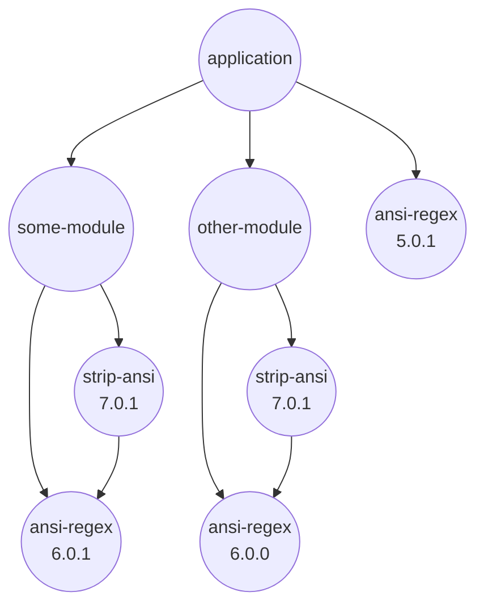
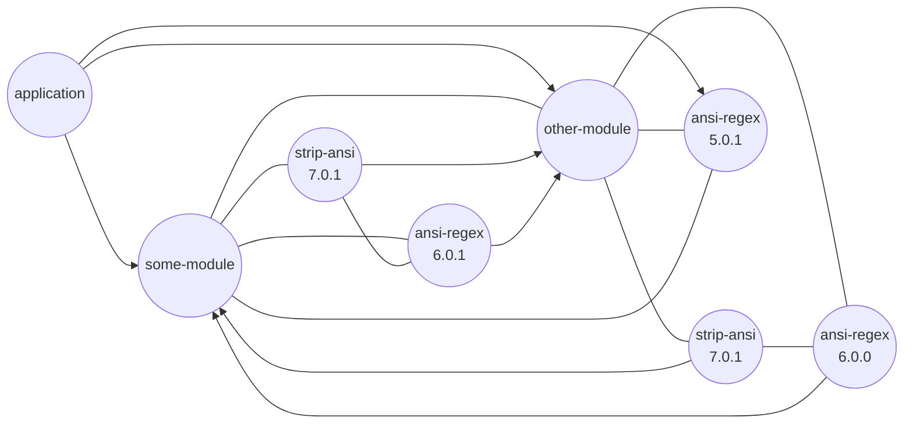

# Result

This document will describe, how certain SBOM results should be deducted.

## Preamble 

Read [NodeJs Internals](nodejs_internals.md) first.

## Examples and Visualisation

Let the dependencies be in a non-range manner.
Let component `strip-ansi@7.0.1` require in a range manner: `ansi-regex@^6`.

### Dependency Graph



### A corresponding File-System Tree

```text
application
└── node_modules
    ├── ansi-regex              <- @5.0.1
    ├── other-module
    │   └── node_modules
    │       ├── ansi-regex      <- @6.0.0
    │       └── strip-ansi      <- @7.0.1
    └── some-module
        └── node_modules
            ├── ansi-regex      <- @6.0.1
            └── strip-ansi      <- @7.0.1
```

### The corresponding Module Resolution Graph



### The resulting CycloneDX SBOM

... to be described

### Component De-duplication

NPM does the needed graph de-duplications internally already when it generates the affective module layout in the file system.  
See [`npm dedupe` docs](https://github.com/npm/cli/blob/latest/docs/lib/content/commands/npm-dedupe.md).

See also: [Component De-duplication](component_deduplication.md)

----

## Project => `bom.metadata.component`

... to be described

## Package => `...component`

... to be described

## Bundled dependencies => `...component.components`

Some projects might have [`bundleDependencies`](https://docs.npmjs.com/cli/v8/configuring-npm/package-json#bundledependencies),
which means, that dependencies are part of a package
and the dependencies of each of these bundled dependencies are part of that package, too.  
This results in a bundle where the project itself and all the `bundleDependencies` are shipped as one blob.

When rendering a CycloneDX document:

* `bundleDependencies` should be rendered as subcomponents of a `component`.
* `bundleDependencies` should be rendered as component with property `cdx:npm:package:path = true`.
* `bundleDependencies` should be treated as regular `dependencies`.

Flattening subcomponents should not be an issue, as long as every component has the property `cdx:npm:package:path` set.

Example:

```json
{
  "$schema": "http://cyclonedx.org/schema/bom-1.4.schema.json",
  "bomFormat": "CycloneDX",
  "specVersion": "1.4",
  "version": 1,
  "metadata": {
    "component": {
      "bom-ref": "@acme/my-project",
      "type": "application",
      "group": "@acme",
      "name": "my-project",
      "purl": "pkg:npm/%40acme/my-project",
      "properties": [
        {
          "name": "cdx:npm:package:path",
          "value": ""
        }
      ]
    }
  },
  "components": [
    {
      "bom-ref": "@acme/my-project|@acme/my-bundled-package@1",
      "type": "library",
      "group": "@acme",
      "name": "my-bundled-package",
      "version": "1",
      "purl": "pkg:npm/%40acme/my-bundled-package@1",
      "properties": [
        {
          "name": "cdx:npm:package:bundled",
          "value": "true"
        },
        {
          "name": "cdx:npm:package:path",
          "value": "node_modules/@acme/my-bundled-package"
        }
      ]
    },
    {
      "bom-ref": "@acme/my-project|@foo/package-A@1",
      "type": "library",
      "group": "@foo",
      "name": "package-A",
      "version": "1",
      "purl": "pkg:npm/%40foo/package-A@1",
      "properties": [
        {
          "name": "cdx:npm:package:bundled",
          "value": "true"
        },
        {
          "name": "cdx:npm:package:path",
          "value": "node_modules/@foo/package-A"
        }
      ]
    },
    {
      "bom-ref": "@bar/package-with-bundled-deps@1",
      "type": "library",
      "group": "@bar",
      "name": "package-with-bundled-deps",
      "version": "1",
      "purl": "pkg:npm/%40bar/package-with-bundled-deps@1",
      "properties": [
        {
          "name": "cdx:npm:package:path",
          "value": "node_modules/@bar/package-with-bundled-deps"
        }
      ],
      "components": [
        {
          "bom-ref": "@bar/package-with-bundled-deps@1|@baz/package-B@1",
          "type": "library",
          "group": "@baz",
          "name": "package-B",
          "version": "1",
          "purl": "pkg:npm/%40baz/package-B@1",
          "properties": [
            {
              "name": "cdx:npm:package:bundled",
              "value": "true"
            },
            {
              "name": "cdx:npm:package:path",
              "value": "node_modules/@bar/package-with-bundled-deps/node_modules/@baz/package-B"
            }
          ]
        },
        {
          "bom-ref": "@bar/package-with-bundled-deps@1|bundled-internal-package",
          "type": "library",
          "name": "bundled-internal-package",
          "purl": "pkg:npm/%40bundled-internal-package",
          "properties": [
            {
              "name": "cdx:npm:package:bundled",
              "value": "true"
            },
            {
              "name": "cdx:npm:package:path",
              "value": "node_modules/@bar/package-with-bundled-deps/node_modules/bundled-internal-package"
            }
          ]
        }
      ]
    },
    {
      "bom-ref": "@foo/package-A@3",
      "type": "library",
      "group": "@foo",
      "name": "package-A",
      "version": "3",
      "purl": "pkg:npm/%40foo/package-A@3",
      "properties": [
        {
          "name": "cdx:npm:package:path",
          "value": "node_modules/@foo/package-A"
        }
      ]
    }
  ],
  "dependencies": [
    {
      "ref": "@acme/my-project",
      "dependsOn": [
        "@acme/my-project|@acme/my-bundled-package@1",
        "@acme/my-project|@foo/package-A@1",
        "@bar/package-with-bundled-deps@1"
      ]
    },
    {
      "ref": "@acme/my-project|@acme/my-bundled-package@1",
      "dependsOn": ["@acme/my-project|@foo/package-A@1"]
    },
    {
      "ref": "@acme/my-project|@foo/package-A@1"
    },
    {
      "ref": "@bar/package-with-bundled-deps@1",
      "dependsOn": [
        "@bar/package-with-bundled-deps@1|bundled-internal-package",
        "@acme/my-project|@foo/package-A@1"
      ]
    },
    {
      "ref": "@bar/package-with-bundled-deps@1|bundled-internal-package",
      "dependsOn": [
        "@bar/package-with-bundled-deps@1|@baz/package-B@1"
      ]
    },
    {
      "ref": "@bar/package-with-bundled-deps@1|@baz/package-B@1"
    },
    {
      "ref": "@foo/package-A@3"
    }
  ]
}
```
