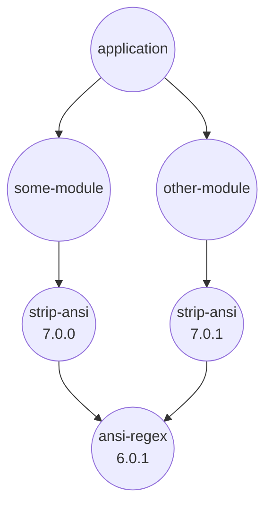
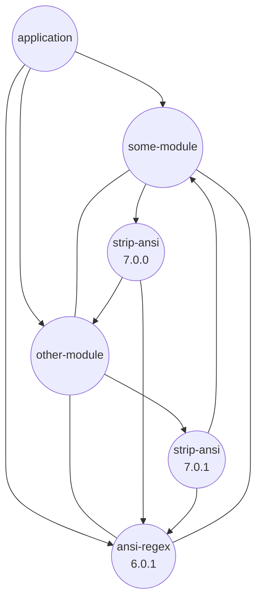

# Result

This document will describe, how certain SBOM results should be deducted.

## Preamble 

### _NodeJS_ Basics

A package might have a name, a version, and dependencies.  
This information is usually stored in a `package.json` file.

A package might have submodules or subpackages.  
These are usually stored in a `node_modules` folder next to the `package.json`.

### How _NodeJS_'s module/package resolution works

_NodeJS_'s module/package system is file-system based. It works regardless of package dependencies.  
When code in package `foo` tries to use/require/access code from a different package "bar",
then _NodeJS_ will look in `foo`'s own/direct `node_modules` folder. 
If it did not find any "bar" there, then NodeJS traverses all folders upwards and does the same lookup there,
until it finds any "bar".  
This file-based loading behavior happens regardless of components' "dependency graph"

read [Node docs](https://nodejs.org/api/packages.html#introduction)

### Implications

Based on this module resolution system it might appear that one complex tree might have multiple individual
instances of module "bar".
Each of these instances might have a different content.
If two of these instances had equal content - on a module basis - they are still not the same module, 
as their own `node_modules` might be different, which causes submodules being not the same.
If two of these instances had equal content - on a module basis - they are still not the same module,
as their position in the global module-resolution-tree is different and therefore causes this very instances
to have different dependencies in the first place.  
So two modules with equal file content are never the same module.

Imagine each NodeJS-module as a node in a directed graph.  
Each node has a set of properties. Properties represent file-content(checksums), module-name, and so on.
A directed edge in this graph represents module access in terms of node's module-resolution-system. Therefore, the graph is not implicit.
This graph is per definition in the format of a directed tree.  
In that graph two nodes are identical, if and only if:  
a) both sets of node properties are equal, and 
b) both sets of all direct and transitive edges form equal complete sub-graphs from tree-root to that node, and
c) both sets of all direct and transitive edges form equal complete sub-graphs from that node to each accessible leaf.

### Examples and Visualisation 

#### dependency tree


#### the file-system tree
```text
application
|- node_modules
   |- some-module
   |  |- node_modules
   |     |- strip-ansi
   |
   |- other-module
   |  |- node_modules
   |     |- strip-ansi
   |
   |- ansi-regex
```

#### module resolution graph


#### CycloneDX SBOM

... to be described

### De-duplication

NPM does the needed graph de-duplications internally already when it generates the affective module layout in the file system.
This makes additional after-the-fact deduplication redundant.

All additional logic how module de-deduplication could be done will come to the conclusion that it is invalid per definition,
due to the previously described rules of graph/node identity that applies here.

See [Milestone: after-the-fact component deduplication](https://github.com/CycloneDX/cyclonedx-node-npm/milestone/2)  
See [Discussion: describe how component de-duplication works](https://github.com/CycloneDX/cyclonedx-node-npm/discussions/307)  

----

## Project -> `bom.metadata.component`

... to be described

## Package -> `...component`

... to be described

## Bundled dependencies -> `...component.components`

Some projects might have [`bundleDependencies`](https://docs.npmjs.com/cli/v8/configuring-npm/package-json#bundledependencies),
which means, that dependencies are part of a package
and the dependencies of each of these bundled dependencies are part of that package, too.  
This results in a bundle where the project itself and all the `bundleDependencies` are shipped as one blob.

When rendering a CycloneDX document:

* `bundleDependencies` should be rendered as subcomponents of a `component`.
* `bundleDependencies` should be rendered as component with property `cdx:npm:package:path = true`.
* `bundleDependencies` should be treated as regular `dependencies`.

Flattening subcomponents should not be an issue, as long as every component has the property `cdx:npm:package:path` set.

Example:

```json
{
  "$schema": "http://cyclonedx.org/schema/bom-1.4.schema.json",
  "bomFormat": "CycloneDX",
  "specVersion": "1.4",
  "version": 1,
  "metadata": {
    "component": {
      "bom-ref": "@acme/my-project",
      "type": "application",
      "group": "@acme",
      "name": "my-project",
      "purl": "pkg:npm/%40acme/my-project",
      "properties": [
        {
          "name": "cdx:npm:package:path",
          "value": ""
        }
      ]
    }
  },
  "components": [
    {
      "bom-ref": "@acme/my-project|@acme/my-bundled-package@1",
      "type": "library",
      "group": "@acme",
      "name": "my-bundled-package",
      "version": "1",
      "purl": "pkg:npm/%40acme/my-bundled-package@1",
      "properties": [
        {
          "name": "cdx:npm:package:bundled",
          "value": "true"
        },
        {
          "name": "cdx:npm:package:path",
          "value": "node_modules/@acme/my-bundled-package"
        }
      ]
    },
    {
      "bom-ref": "@acme/my-project|@foo/package-A@1",
      "type": "library",
      "group": "@foo",
      "name": "package-A",
      "version": "1",
      "purl": "pkg:npm/%40foo/package-A@1",
      "properties": [
        {
          "name": "cdx:npm:package:bundled",
          "value": "true"
        },
        {
          "name": "cdx:npm:package:path",
          "value": "node_modules/@foo/package-A"
        }
      ]
    },
    {
      "bom-ref": "@bar/package-with-bundled-deps@1",
      "type": "library",
      "group": "@bar",
      "name": "package-with-bundled-deps",
      "version": "1",
      "purl": "pkg:npm/%40bar/package-with-bundled-deps@1",
      "properties": [
        {
          "name": "cdx:npm:package:path",
          "value": "node_modules/@bar/package-with-bundled-deps"
        }
      ],
      "components": [
        {
          "bom-ref": "@bar/package-with-bundled-deps@1|@baz/package-B@1",
          "type": "library",
          "group": "@baz",
          "name": "package-B",
          "version": "1",
          "purl": "pkg:npm/%40baz/package-B@1",
          "properties": [
            {
              "name": "cdx:npm:package:bundled",
              "value": "true"
            },
            {
              "name": "cdx:npm:package:path",
              "value": "node_modules/@bar/package-with-bundled-deps/node_modules/@baz/package-B"
            }
          ]
        },
        {
          "bom-ref": "@bar/package-with-bundled-deps@1|bundled-internal-package",
          "type": "library",
          "name": "bundled-internal-package",
          "purl": "pkg:npm/%40bundled-internal-package",
          "properties": [
            {
              "name": "cdx:npm:package:bundled",
              "value": "true"
            },
            {
              "name": "cdx:npm:package:path",
              "value": "node_modules/@bar/package-with-bundled-deps/node_modules/bundled-internal-package"
            }
          ]
        }
      ]
    },
    {
      "bom-ref": "@foo/package-A@3",
      "type": "library",
      "group": "@foo",
      "name": "package-A",
      "version": "3",
      "purl": "pkg:npm/%40foo/package-A@3",
      "properties": [
        {
          "name": "cdx:npm:package:path",
          "value": "node_modules/@foo/package-A"
        }
      ]
    }
  ],
  "dependencies": [
    {
      "ref": "@acme/my-project",
      "dependsOn": [
        "@acme/my-project|@acme/my-bundled-package@1",
        "@acme/my-project|@foo/package-A@1",
        "@bar/package-with-bundled-deps@1"
      ]
    },
    {
      "ref": "@acme/my-project|@acme/my-bundled-package@1",
      "dependsOn": ["@acme/my-project|@foo/package-A@1"]
    },
    {
      "ref": "@acme/my-project|@foo/package-A@1"
    },
    {
      "ref": "@bar/package-with-bundled-deps@1",
      "dependsOn": [
        "@bar/package-with-bundled-deps@1|bundled-internal-package",
        "@acme/my-project|@foo/package-A@1"
      ]
    },
    {
      "ref": "@bar/package-with-bundled-deps@1|bundled-internal-package",
      "dependsOn": [
        "@bar/package-with-bundled-deps@1|@baz/package-B@1"
      ]
    },
    {
      "ref": "@bar/package-with-bundled-deps@1|@baz/package-B@1"
    },
    {
      "ref": "@foo/package-A@3"
    }
  ]
}
```
